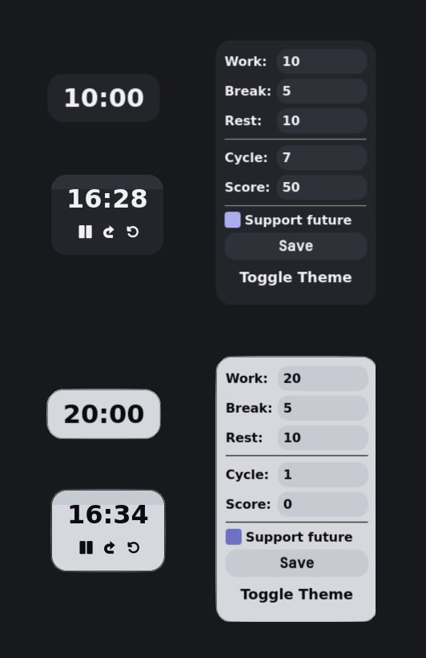

> "Time on the stage is a continuous performance"
# What is Entracte?
**Entracte** is a customizable Pomodoro-based time management application tailored for individuals and teams seeking deliberate structure, measurable progress, and clever rest.
## Features
🪄**Cycle Structuring**: Define separate durations for:
  - Work intervals
  - Short breaks
  - Long restorative pauses
🔁 **Cycle Management**: Configure total number of work/break cycles before a long rest is introduced.
🎯 **Score Tracking**: Monitor cumulative productivity with our score system.
🔒 **Break Screen Lock**: Enforced screen lock during breaks prevents inefficient task-switching and supports authentic recovery.
🧠 **Support Future Mode**: Turn on to support our development team going forward
🎨 **Theme Switching**: Toggle between light and dark themes to match environmental conditions or user preference.
## Interface
The application interface presents:
1. Compact appearance for continuous operation.
2. Control panel that appears when you hover over the timer.
3. Settings window.
Controls:
1. Hold on any empty space to move the timer around your screen.
2. Click on time to open the settings.
3. Feel free to ask!
## Use Cases
- Cognitive workers following Pomodoro, Circlular Productivity, or Deep Work routines.
- Students, researchers, or engineers managing high-friction intellectual tasks.
- Artists, developers, or system designers using stimulus control and rhythm enforcement as creativity catalysts.
- Digital minimalists seeking behavioral automation tools.
## Installation
💞 Btw, Entracte matches perfectly with Hyprland
### 🧩 Arch Linux (AUR)
If you're on Arch or a compatible distribution, you can install Entracte directly from the AUR:
```bash
yay -S entracte
```
### ❄️ Nix/NixOS
Entracte provides a reproducible build via `flake.nix`. To run the app using Nix flakes:
```bash
nix run github:6e6f303216/entracte
```
Or build it locally:
```bash
nix build .#entracte
```
Make sure you have flakes enabled in your Nix configuration!
### 🐍 Build from Source (Cross-platform, via PyInstaller)
```bash
git clone https://github.com/6e6f303216/entracte
cd entracte
pip install -r requirements.txt
pyinstaller entracte.spec
```
### 🪟 Windows
A pre-built `.exe` installer is available in the [Releases](https://github.com/yourusername/entracte/releases) section. Note that Windows support is experimental and under active development. Expect rapid improvements in upcoming versions.
## Philosophy
Derived from French term for "between acts," **Entracte** is designed to orchestrate your time into distinct periods of exertion and renewal. Just as silence organizes music, so does rest organize labor.
## 🔗 Community & Support
✨ **Wonders are closer than they seem** — [@wondermakers_space](https://t.me/wondermakers_space)
If you enjoy using Entracte and want to support its development:
- 💖 Boosty: [https://boosty.to/wondermakers/donate](https://boosty.to/wondermakers/donate)
- **Crypto donations** welcome:
  - **BTC**: `bc1psxndmtpkr62x0ur59cpglnnln3ksv4s5jrxf36ck3juqawvq5z0qsy6zh7`
  - **ETH/XRP**: `0x40e751968dD0Cd719136239b46B8D4aCE5Fdc7DB`
  - **TON**: `UQCdNwz7E3GJ6fVQKAvZ37b9y585c-oKjfaU9YtyjMWd4cTp`
  - **XMR**: `88kKb7VwHuaLcuhb3LESMFKaUXGp2BMc3CowWcmVBtM9LNPYTdXc2FdGVfz4xbsvKPcewkBhRizTmZ3kH5BgmK3wMLaaTrp`
  - **SOL**: `9M5BLLzq4z7n1xQZBnsaNgzeeAsQiXyY1BBptR5LNJWz`
